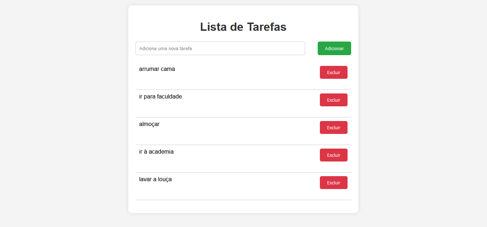

# Lista de Tarefas - Proposta de Projeto

## Descrição do Projeto
Este é um projeto simples de **lista de tarefas** desenvolvido em Flask com integração ao banco de dados SQLite. A proposta é criar uma interface minimalista, onde os usuários podem adicionar e excluir tarefas de forma rápida e intuitiva.

A interface inclui um formulário para adicionar novas tarefas e uma lista de tarefas já criadas, com botões para excluí-las. As funcionalidades são integradas ao banco de dados SQLite, garantindo que as informações permaneçam armazenadas mesmo após o fechamento da aplicação.

---

## Funcionalidades
- Adicionar novas tarefas
- Excluir tarefas
- Interface simples e intuitiva
- Persistência de dados com banco de dados SQLite

---

## Tecnologias Utilizadas
- **Flask**: Framework web usado para gerenciar as rotas e o backend do projeto.
- **SQLite**: Banco de dados leve e de fácil configuração para armazenar as tarefas.
- **HTML5 e CSS3**: Estrutura e estilização da interface.
  
---

## Estrutura do Projeto
```bash
task_list/
│
├── static/
│   └── styles.css
├── templates/
│   └── index.html
├── app.py
└── tasks.db (será criado automaticamente)
```

---

## Design do Projeto 

